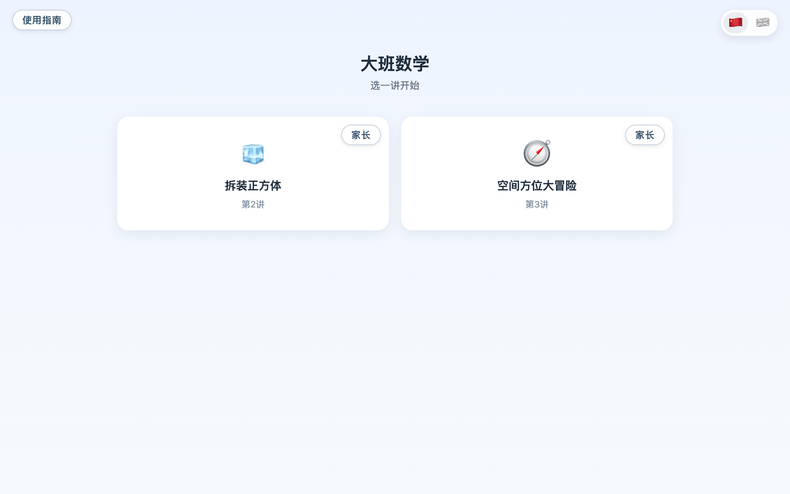

# math-edu · 给一个 5 岁孩子做的大班数学配套网站

A voice-first math practice site built for one specific 5-year-old, working
through a pre-K math workbook one lesson at a time. The child can't read yet,
so every instruction is spoken aloud (cloud TTS with a child voice, falling
back to the browser's built-in Web Speech API when no API key is configured);
some activities let the child answer out loud through the microphone, and one
lets the child hold a paper cube up to the webcam for a vision model to admire. It is a
personal family project — one child, one site — published here in case the
approach or the code is useful to someone else. Code is MIT-licensed; lesson
content and AI-generated art are CC BY-NC 4.0 (see below).



## 这是什么

一个**个人家庭项目**：给自家一个 5 岁孩子（大班）做的数学配套网站，配套一本
大班数学教材，一讲一讲往前做。几个前提决定了它的形状：

- **语音优先。** 孩子不识字，所以屏幕上没有句子——每条指令都念出来
  （云端童声 TTS，没配 key 时自动退到浏览器内置的 Web Speech 朗读），
  屏幕上只出现图形和该讲正在教的那几个字（比如「东南西北」）。
  几讲支持孩子对着麦克风说答案（云端 ASR + 判对），第 2 讲还能把折好的
  纸正方体举到摄像头前，让视觉模型看一眼、夸一句。
- **离线可用。** three.js 等依赖全部 vendored 进仓库，不引 CDN；断网时
  语音退到 Web Speech，课照上。
- **桌面和 iPhone 都是一等公民。** 每讲画在一块固定逻辑分辨率的「基准舞台」上，
  整体缩放适配屏幕；手机上强制横屏（竖屏会出一个「把手机转过来」的提示动画）。
- **双语。** 一个 🇨🇳/🇬🇧 图形开关整站切换中文课 / 英文课——不是给中文课配英文
  旁白，而是一门平行的英文课（教的字形本身变成英文单词）。

目前有两讲：**第 2 讲 拆装正方体**（3D 折叠引擎 + 打印纸样动手折）和
**第 3 讲 空间方位大冒险**（14 个环节的关卡地图）。每讲配一页给大人读的
**家长伴读页**（教学要点与答案），另有一页站级**使用指南**。


## 自用声明

- 这是**非官方**项目，与任何教材出版方无关。
- 它为一个特定的孩子而做，功能取舍只跟着这个孩子走：**不接功能需求**，
  Issue / PR 欢迎提，但**不保证响应**。
- 欢迎 fork 后自部署、自改——部署踩过的坑都记在 `docs/` 里了。

## 本地跑起来

需要 [uv](https://docs.astral.sh/uv/)（Python 包管理器）。两条命令：

```bash
uv sync
uv run uvicorn math_edu.app:app --port 8300
```

打开 `http://localhost:8300` 就能玩。**不配任何 API key 也能玩**：语音朗读
自动退到浏览器内置的 Web Speech；想要云端童声 TTS、语音答题（ASR）和摄像头
环节，把 `.env.example` 复制成 `.env`、填入自己的百炼（DashScope）API key 即可。
本机默认无登录墙、不连数据库（`AUTH_MODE=off`），账号体系只在公网部署时启用。

跑测试（纯逻辑测试，node 只用来跑测试，网站本身不需要它）：

```bash
npm test
```

## 架构一瞥

FastAPI 薄后端只做三件事：扫描 `chapters/` 自动挂载每一讲、渲染首页、
代理 `/api/*` 的语音与视觉调用。前端零构建、原生 ES modules：每讲一个
自包含目录，跨讲共用的语音引擎（说话 / 录音 / 判对 / 问答调度 / 基准舞台 /
云同步……）在 `web/shared/`。前端代码用中文标识符是刻意的约定，与教材
词汇一一对应。

想看全貌：

- [`CLAUDE.md`](CLAUDE.md) — 全站结构地图与工程家规（最全的一份自述）；
- [`docs/adr/`](docs/adr/) — 架构决策记录（为什么折叠引擎是通用的、
  为什么触屏方案是基准舞台……）；
- [`docs/daily-log/`](docs/daily-log/) — 开发日志。

一处说明：`CLAUDE.md` 里引用的 `.scratch/` 是内部工作票目录（评审记录、
工程票据），**不随开源仓发布**，所以你在本仓看不到它——那些引用失效是刻意的。

## 许可证：代码 MIT，内容 CC BY-NC

本仓库双许可证，分界如下：

- **代码 = MIT**（根目录 [`LICENSE`](LICENSE)）：语音引擎、基准舞台、
  折叠引擎、云同步这些通用件，拿去用在自己的项目里，商用也行。
- **教学内容与素材 = CC BY-NC 4.0**（[`LICENSE-CONTENT`](LICENSE-CONTENT)）：
  各讲的台词表、题库、活动设计、家长伴读页，以及
  `web/shared/assets/实体图/` 下全部 AI 生成图——署名、**不得商用**。

`web/shared/vendor/` 下的第三方库（如 three.js）遵循其自带许可证。
