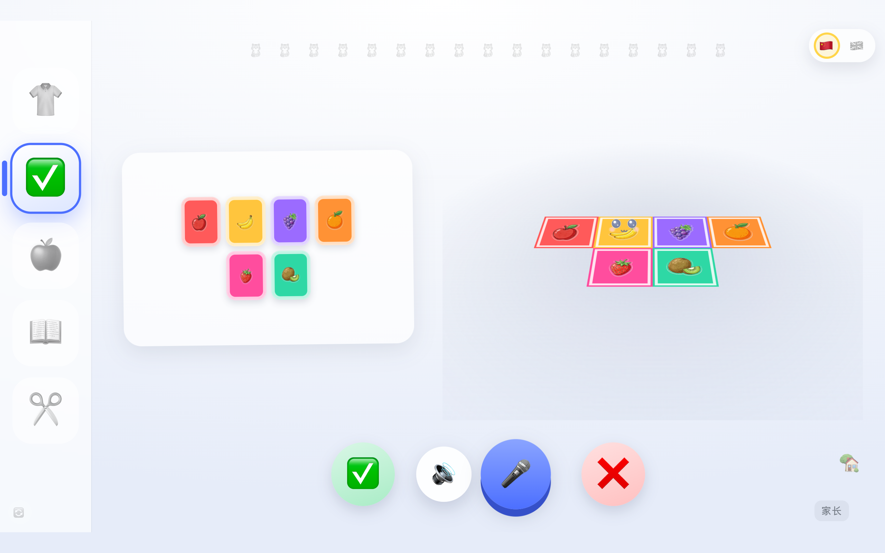
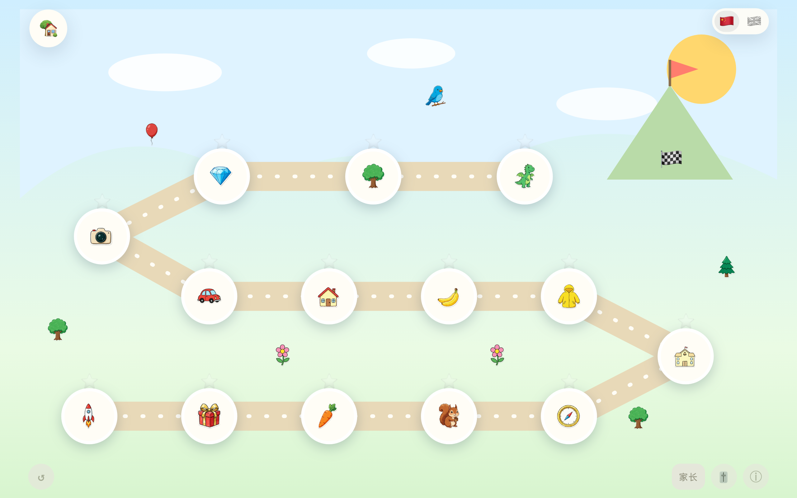
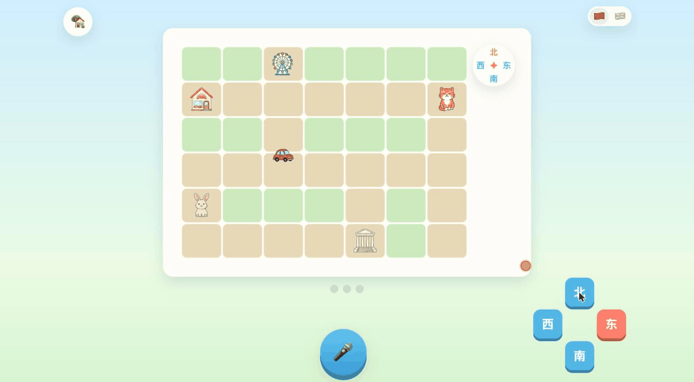
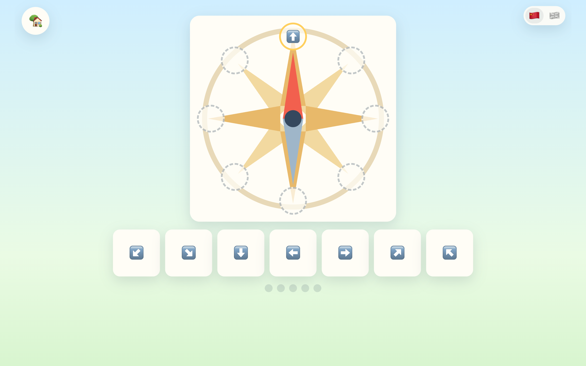

# math-edu · 给一个 5 岁孩子做的大班数学配套网站

中文 · [English](#english)

给自家一个还不识字的 5 岁孩子做的**语音优先**数学配套网站：每条指令都
念出来，孩子用嘴答、用手摸、举给摄像头看。起点是一道口述不清的正方体
折叠题（下图），后来长成了一讲一讲的完整课程。代码 MIT，课程内容与
AI 生成图 CC BY-NC 4.0（见文末）。


## 缘起：一道口述不清的折叠题

给孩子讲「正方体展开图」那一讲时卡住了：书上问哪几个图形能围成正方体，
嘴上怎么比划都说不明白，买套教具又得等快递——而手边就有一台 Mac。
于是那件「衣服」变成了屏幕上可以拖着折的 3D 正方体：孩子自己在格子纸上
画一个六连格，右边立刻长出立体的它，拖一下滑杆，看它一步步合拢、或者
差一片合不拢。口述失败的那道题，孩子拖两下就懂了。

这一讲做完还有个意外收获：接上大屏、或者拿 iPad 横过来，比守着笔记本
更像一堂课。于是就一讲一讲做了下去。

## 理念：手边的辅导书 + AI = 定制教研

家里谁没有几摞辅导书呢。要学「空间方位」，把好几本书的相关章节拍照，
一起扔给 AI，让它汲取几套教研的精华，来设计课程、关卡和测验——
**书的教学大纲是基石，AI 是教研团队，产出是一个孩子专属的教学网站。**
当代大模型的课程设计能力，足以胜任这种一个孩子、一讲课的定制教研；
这个仓库里的两讲，连同全部工程，就是这套方法论与 Claude 结对的实证。

## 两讲玩法

### 第 2 讲 · 拆装正方体

开头那张 GIF 就是核心玩法：**穿衣服**（沙盒里画六连格，3D 实时试折）。
之后是**猜一猜**——书上原样的 17 道判断题，孩子对着麦克风喊「能 / 不能」，
不想说话就按 ✅ / ❌；答案不是查表，是折叠引擎当场算的：



再往后：**贴水果**（记住每面贴的什么，折起来再问）、**衣服图鉴**（11 件
能合上的衣服的收集册，每折成一件没折过的，对应那格当场点亮）、
**做一件真的**（打印纸样，剪下来折一个真的正方体——折好举到摄像头前，
视觉模型会看一眼、夸一句）。

### 第 3 讲 · 空间方位大冒险

一张关卡地图，14 个环节，从「上下左右」一路走到「东南西北」和路线描述：



「开车」环节：当一回小司机，听指令把客人送到目的地——按「东南西北」
四个字牌，或者直接对麦克风喊方向，小车就沿路开到下一个路口：



「八大罗盘」环节，把方向一块块拼上罗盘——这一讲要教的「东南西北」
四个字，是孩子界面上唯一要认的字；切到英文模式，它们就变成
NORTH / SOUTH / EAST / WEST，整站是一门平行的英文课，不是配音：



## 为 5 岁孩子设计

**多模态输入，孩子怎么顺手怎么来：**

- **听**：每条指令都念出来（云端童声 TTS；没配 key 自动退到浏览器内置
  Web Speech）。屏幕上没有一句要认的字——除了正在教的那几个。
- **说**：麦克风 + 云端 ASR + 判对引擎，「东边」「east」「小狐狸」「狐狸」
  都算对；判对是纯函数，有测试盯着。
- **摸和点**：触摸和鼠标都是一等公民；整讲画在一块固定逻辑分辨率的
  「基准舞台」上，等比缩放到任何屏幕，手机上锁横屏。
- **举给摄像头**：折好的纸正方体举起来，视觉模型看一眼、夸一句。

**防呆，按「孩子一定会误操作」设计：**

- 误触不毁进度：「重来」永远两次确认；备选按钮答完即锁，连点不重复提交。
- 断网、没 key、云端挂了，课照上——语音降级、同步静默休眠，孩子永远
  不会看到报错。
- 进度存 localStorage，登录后云端合并**只增不减**：两台设备各攒的星星
  取并集，谁也不会弄丢谁的。
- 录音有看门狗，音效被浏览器静音会自愈，切走再切回来接着玩。

## 自用声明

- 这是**非官方**项目，与任何教材出版方无关。
- 它为一个特定的孩子而做，功能取舍只跟着这个孩子走：**不接功能需求**，
  Issue / PR 欢迎提，但**不保证响应**。
- 欢迎 fork 后自部署、自改——照上面的理念，换一本你手边的书、
  做你孩子的下一讲。部署踩过的坑都记在 `docs/` 里了。

## 本地跑起来

需要 [uv](https://docs.astral.sh/uv/)（Python 包管理器）。两条命令：

```bash
uv sync
uv run uvicorn math_edu.app:app --port 8300
```

打开 `http://localhost:8300` 就能玩。**不配任何 API key 也能玩**：语音朗读
自动退到浏览器内置的 Web Speech；想要云端童声 TTS、语音答题（ASR）和摄像头
环节，把 `.env.example` 复制成 `.env`、填入自己的百炼（DashScope）API key 即可。
本机默认无登录墙、不连数据库（`AUTH_MODE=off`），账号体系只在公网部署时启用。

跑测试（纯逻辑测试，node 只用来跑测试，网站本身不需要它）：

```bash
npm test
```

## 架构一瞥

FastAPI 薄后端只做三件事：扫描 `chapters/` 自动挂载每一讲、渲染首页、
代理 `/api/*` 的语音与视觉调用。前端零构建、原生 ES modules：每讲一个
自包含目录，跨讲共用的语音引擎（说话 / 录音 / 判对 / 问答调度 / 基准舞台 /
云同步……）在 `web/shared/`。前端代码用中文标识符是刻意的约定，与教材
词汇一一对应。

想看全貌：

- [`CLAUDE.md`](CLAUDE.md) — 全站结构地图与工程家规（最全的一份自述）；
- [`docs/adr/`](docs/adr/) — 架构决策记录（为什么折叠引擎是通用的、
  为什么触屏方案是基准舞台……）；
- [`docs/daily-log/`](docs/daily-log/) — 开发日志。

一处说明：`CLAUDE.md` 里引用的 `.scratch/` 是内部工作票目录（评审记录、
工程票据），**不随开源仓发布**，所以你在本仓看不到它——那些引用失效是刻意的。

## English

A voice-first math site built for one specific 5-year-old — born the day a
paper-folding exercise defeated spoken language. The workbook asked which flat
shapes fold into a cube; the parent found this impossible to explain in words,
and mail-ordering physical teaching aids felt absurd next to the laptop already
on the desk. So the cube became 3D and draggable (the GIF at the top) — and
then a whole lesson-by-lesson site grew around it.

The child can't read yet, so every instruction is spoken aloud (cloud TTS with
a child voice, falling back to the browser's Web Speech API when no key is
configured); answers come by voice (cloud ASR + a language-blind judging
engine), by touch or tap, and one activity has the child hold a folded paper
cube up to the webcam for a vision model to admire. A single 🇨🇳/🇬🇧 toggle
switches the whole site to a parallel English course — the taught glyphs
东南西北 themselves become NORTH / SOUTH / EAST / WEST.

The underlying idea: photograph the relevant chapters of the workbooks you
already own, feed them to an AI to distill the essence, and let it design the
course, levels and quizzes — the books' outlines as the foundation, AI as the
curriculum team, a site tailored to one child as the output.

Run it locally with `uv sync && uv run uvicorn math_edu.app:app --port 8300` —
no API key needed to play. This is a personal family project: unofficial,
feature requests not taken, forks welcome. Code is MIT; lesson content and
AI-generated art are CC BY-NC 4.0.

## 许可证：代码 MIT，内容 CC BY-NC

本仓库双许可证，分界如下：

- **代码 = MIT**（根目录 [`LICENSE`](LICENSE)）：语音引擎、基准舞台、
  折叠引擎、云同步这些通用件，拿去用在自己的项目里，商用也行。
- **教学内容与素材 = CC BY-NC 4.0**（[`LICENSE-CONTENT`](LICENSE-CONTENT)）：
  各讲的台词表、题库、活动设计、家长伴读页，以及
  `web/shared/assets/实体图/` 下全部 AI 生成图——署名、**不得商用**。

`web/shared/vendor/` 下的第三方库（如 three.js）遵循其自带许可证。
